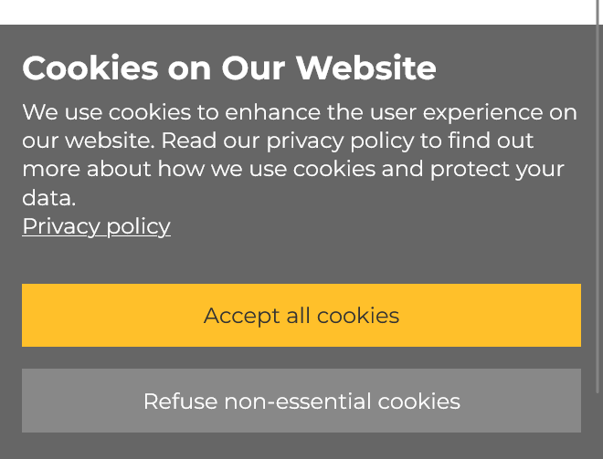
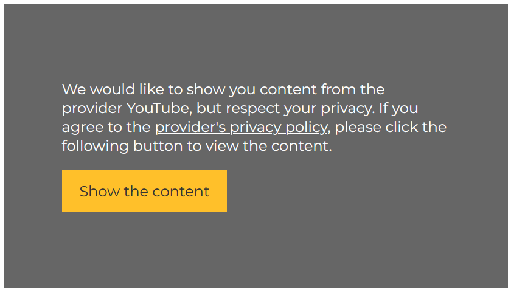

======================
feincms3-cookiecontrol
======================

Despite its name and the fact that it is documented as a part of
feincms3, feincms3-cookiecontrol can also be used standalone.

Cookie control
==============

Some jurisidictions require the the users' consent before adding analytics
scripts and tracking cookies. While it may be best to not use any analytics and
tracking at all this may not be possible or even desirable in all
circumstances.

Many solutions exist for adding a consent banner to the website. Some of those
banners require loading JavaScript and other assets from external servers. This
raises some questions because loading those scripts may also be seen as
tracking already. It is certainly safer to implement a cookie control panel
locally. It would be boring to start from scratch on each site.

This guide explains how to use `feincms3-cookiecontrol <https://github.com/feinheit/feincms3-cookiecontrol/>`__.

Installation
~~~~~~~~~~~~

Install the package:

.. code-block:: shell

    venv/bin/pip install feincms3-cookiecontrol

Add ``feincms3_cookiecontrol`` to ``INSTALLED_APPS``:

.. code-block:: python

    INSTALLED_APPS = [
        # ...
        "feincms3_cookiecontrol",
    ]

Apply the initial migration:

.. code-block:: shell

    python manage.py migrate

Add the panel to the template, e.g. in ``base.html`` at the end of the
``<body>`` element:

.. code-block:: html+django

    <!doctype html>
    <html>
      ...
      <body>
        ...
        
      </body>
    </html>

You'll have to add all tracking scripts yourself now.

The presentation of the panel is a fixed banner at the bottom of the
viewport. Once any cookies have been accepted (essential cookies have to be
accepted, e.g. the CSRF cookie) the banner is replaced by a single button which
allows showing the control panel again.

Customize the appearance
~~~~~~~~~~~~~~~~~~~~~~~~

The default colors of the control panel may not fit into your site. The best
way to customize the appearance is to set a few CSS variables, e.g.:

.. code-block:: css

    .f3cc {
      --f3cc-background: #e9e9e9;
      --f3cc-foreground: #000000;
      --f3cc-button-background: #cbcbcb;
      --f3cc-accept-background: #90f690;
      --f3cc-button-foreground: #cbcbcb;
      --f3cc-accept-foreground: #cbcbcb;
    }

It's recommended to set all variables if you set a single one; the exception is
``--f3cc-button-foreground`` which defaults to the value of
``--f3cc-foreground`` and ``--f3cc-accept-foreground`` which defaults to the
value of ``--f3cc-button-foreground``.

Hiding the modify button
~~~~~~~~~~~~~~~~~~~~~~~~

You may want to suppress the button to modify the consent on some pages, for
example on all pages except for the privacy policy. A good way to achieve this
follows.

Let's assume you're using page types as described in the feincms3 templates and
regions guide. Let's also assume that your privacy policy page uses the
standard page type described in the guide:

.. code-block:: python

    class Page(AbstractPage, PageTypeMixin):
        TYPES = [
            TemplateType(
                key="standard",
                title=_("standard"),
                template_name="pages/standard.html",
                regions=[
                    Region(key="main", title=_("Main")),
                ],
            ),
        ]

We will add an additional page type which can be used as a marker. Since we're
using feincms3 apps be sure to read the introduction to feincms3 apps if you
haven't done this already. You may also want to take a look at the feincms3
root passthru reference.

.. code-block:: python

    class Page(AbstractPage, PageTypeMixin):
        TYPES = [
            TemplateType(
                key="standard",
                title=_("standard"),
                template_name="pages/standard.html",
                regions=[
                    Region(key="main", title=_("Main")),
                ],
            ),
            ApplicationType(
                key="privacy-policy",
                title=_("privacy policy"),
                urlconf="feincms3.root.passthru",
                template_name="pages/standard.html",
                regions=[
                    Region(key="main", title=_("Main")),
                ],
            ),
        ]

.. note::
   We cannot just use a new ``TemplateType`` because we **only** want to hide
   the button on all other pages if a privacy policy page actually exists!

Now you can extend the ``page_context`` helper:

.. code-block:: python

    from feincms3.root.passthru import reverse_passthru

    def page_context(request, *, page=None):
        ...
        context = {
            ...
        }
        if url := reverse_passthru("privacy-policy", fallback=None):
            context["privacy_policy_url"] = request.build_absolute_uri(url)
        return context

Now you can use this additional variable in the template:

.. code-block:: html+django

    <!doctype html>
    <html>
      ...
      <body>
        ...
        
        
      </body>
    </html>

The frontend code will automatically add a link to the privacy policy to the
banner's content and will only show the modify button if the current location
matches the privacy policy's URL.

Using the panel from a different site
~~~~~~~~~~~~~~~~~~~~~~~~~~~~~~~~~~~~~

The panel can be integrated into another site by following these steps.

Set the domain for the cookie so that the cookie is available on subdomains (be
sure to check the relevant guides to understand what the problems may be when
doing this and what restrictions you have to honor):

.. code-block:: python

    COOKIECONTROL = {"domain": "example.com"}

Add the view and optionally provide the privacy policy URL:

.. code-block:: python

    from feincms3.root.passthru import reverse_passthru_lazy
    from feincms3_cookiecontrol.views import inject

    urlpatterns = [
        # Base case
        path("f3cc-inject.js", inject),

        # Using reverse_passthru_lazy.
        # NOTE! The inject view uses `request.build_absolute_uri` to
        # complete the URL, you do not have to add the domain and
        # protocol yourself here.
        path(
            "f3cc-inject.js",
            inject,
            {"privacy_policy_url": reverse_passthru_lazy("privacy-policy", fallback="/")},
        ),
    ]

Embed the script:

.. code-block:: html

    

.. note::
   The preferred way to embed the panel is using the template tag. The template
   tag method only requires an additional request for a static asset while the
   method using a view requires an additional request to a view.

Selectively embed iframes or other third party scripts
~~~~~~~~~~~~~~~~~~~~~~~~~~~~~~~~~~~~~~~~~~~~~~~~~~~~~~

If users do not consent to your cookie policy, embedding third party scripts or iframes
might violate data protection laws, since personal data is transfered to a third party
without the users knowledge or consent. One way is to disable third party content
alltogether or selectively asking users to consent to the data policies of specific
providers. The letter is accomplished by the 'conscious embed' functionality.

Extend default providers in your ``settings.py``:

.. code-block:: python

    EMBED_PROVIDERS = {
        "some-provider": {
            "title": "Mailchimp",
            "privacy_policy_url": "https://mailchimp.com/legal/privacy/",
        },
    }

Surround the embedded code with the template block ``embed``:

.. code-block:: html

    ...
    
    ...
    

        
        
        
    

    ...

Users that did not consent to your general cookie policy will now get asked to allow
embedding content of specific providers.

You can also wrap your default renderer for embedded content plugins like
``feincms3.plugins.external`` or ``feincms3.embedding``, but you have to
explicitly specify the provider (as above with the ````
template tag).

If HTML is added dynamically to the site which contains such embedded fragments
you have to call the ``f3ccRenderEmbeds()`` JavaScript function yourself to
embed the third party content which has already been accepted by the user.

Automatically embedding content using an URL only
~~~~~~~~~~~~~~~~~~~~~~~~~~~~~~~~~~~~~~~~~~~~~~~~~

The ``feincms3_cookiecontrol.embedding`` module also offers an ``embed``
function where you can only pass an URL and either you get back the wrapped
embed code or nothing at all. You may also specify your own embed providers; in
this case you should also add a ``handler`` key to the ``EMBED_PROVIDERS``
setting; the function only receives the URL and returns either the embedding
HTML or ``None`` if the URL isn't using the provider at all. At the time of
writing the module supports embedding YouTube and Vimeo URLs.

You may use the ``embed`` shortcut as follows:

.. code-block:: python

    # ...
    from feincms3_cookiecontrol.embedding import embed
    # ...
    class EmbeddedVideo(plugins.external.External, PagePlugin):
        # ...
        def embedded_html(self):
            return embed(self.url)

The same functionality is also available directly in templates:

.. code-block:: html

    ...
    
    
    ...
